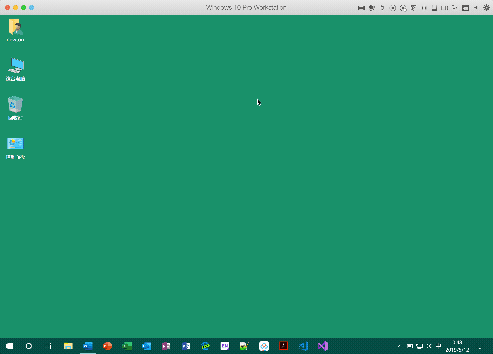
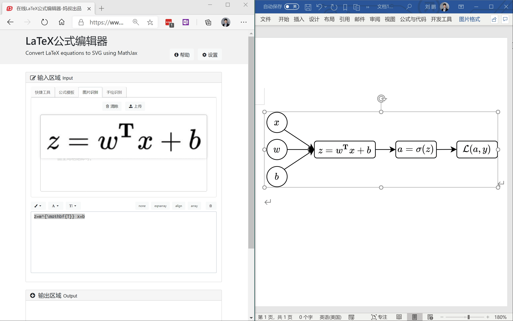

#! https://zhuanlan.zhihu.com/p/63555192

# Microoft Word 数学公式完美解决方案 （Replace_MathType)


与本文章相关的**所有内容**，都可以在[这个](https://github.com/LittleNewton/Replace_MathType) GitHub 仓库里找到！

本文会不定期更新，希望能及时查看 commit message 以获取更新内容。

## 1. 一切基于 Microsoft Office 365

### 1.1 Office 365 ⭐⭐⭐⭐⭐

本库的基础软件是Windows 10 Office 365（下称365），一般的Office 2016 / 2019 可行性未知。Office 365 会给与最新的软件支持，所以在兼容性与新特性上面会有相当大的优势。

⚠️ 如何低价购买正版 Office 365？可淘宝（taobao.com）搜索「Office 365 家庭版 拆分」关键词。

下图显示了365的公式菜单，可以看到，已经官方支持 $\LaTeX$ 语法了！



> 特别注意，Office 365 的全部功能已经在 macOS 10.14.5 及以后的版本里得到了支持，而且，**Word for macOS 也支持 LaTeX 语法输入！**

### 1.2 mathpix 软件 ⭐⭐⭐⭐

mathpix是一个公式OCR软件，通过该软件，可以提取图片中的印刷体公式。虽然该公司声称该软件可以提取手写的公式，但是实际效果并不好。

> 官方地址：https://mathpix.com/

直接在官网下载二进制安装包即可使用。目前已经有比较好的解决方案，所以不再提供安装包下载。

### 1.3 通过 mathpix.store 网站充值 mathpix ⭐⭐⭐⭐

目前我测试了购买情况，发现价格挺便宜，而且是独立账号，可以去这个网站看看。网址是 mathpix.store 。

**如果可以把上述几个软件结合使用，那么在写论文的背景知识的过程中，写公式效率可以提升10倍左右！**

### 1.3 `latexLive.com` 网站 ⭐⭐⭐⭐⭐

这个网站是著名的哔哩哔哩 UP 主【[妈咪说MommyTalk](妈咪说MommyTalk)】开发的一款 web [程序](latexlive.com)，该程序内部集成了 mathpix 的接口，可以非常方便地进行公式在线编辑、公式 OCR。在 Windows10 系统上通过 `win Shift S` 键截图到剪贴板，然后在 latexLive.com 网站对应页面进行全局粘贴，可以很快速地实现 OCR，macOS 也可以通过某些截图软件实现该功能。


> ↑ latexLive.com 的威力！

## 2. 为什么不用MathType等插件

### 2.1 收费软件

价格很昂贵，而且盗版体验很差，注意⚠️：免费的永远是最贵的！

其他的诸如 Axmath 之类的小众软件，输出效果不错，不过输出的 PDF 是不可选中、不可搜索版本，格式应该是某种矢量图（放大之后可以明显看到不光滑的边界）。

### 2.2 Office 365 内置功能原生、优秀

Office 365 的内置公式比较强大。渲染之后与原文档锲合度最高。

虽然365也是付费软件（淘宝家庭版拆分装，仅 50 RMB / 年），不过在当下中国的大学，没有微软的 Word 还真的是玩不转，不如弃暗投明。用好 Word，一样能做出漂亮的文稿。这里就不谈 Word 与 LaTeX 的优劣了。

> **365 内置的公式，支持段落调节，而 MathType 等插件生成的公式，不支持自动调节，在某些情况下很是难看。**

## 3. 安装字体 ⭐⭐⭐⭐⭐

要使用下面这个demo方案，需要安装一款字体：`Latin Modern Math`。本 Repository 已经给出，直接切换到 `01. Latin Modern Math/otf/` 文件夹下，找到 latinmodern-math.otf 文件，右键->安装即可。macOS 用户自己对照摸索，非常简单。

这个字体相对比较好看，不过这里也提供了其他一些解决方案。

## 4. 示例

### 4.1 在 Word 中利用原生公式编译器 ⭐⭐

在 Windows Office 365 Word 里面（PPT 不支持）：

- Step 1 按下 `Alt =`   调出公式输入框
- Step 2 按下 `Ctrl Shift =`  将公式转为**线性**，同时在**公式选项卡**里把公式切换为 $\LaTeX$
- Step 3 复制黏贴这段代码到公式输入框：

``` latex
\left(x+a\right)^n=\sum_{k=1}^{n}\int_{t_1}^{t_2}{\binom{n}{k}{f(x)}^ka^{n-k}}\box(24&dx)
```

- Step 4 按下 `Ctrl =` 渲染公式。注意，如果你是在表格中输入公式，那么需要手动右键更改为专业模式，快捷键不起作用。


Just enjoy it.

### 4.2 利用 latexlive.com 导出 MathML 对象粘贴到 Word ⭐⭐⭐⭐⭐


> 如果你的网络访问 latexLive.com 没问题的话，建议使用这个方法。因为 Word 自带的编辑器有可能抽风。

## 5. 输出 Word 为 PDF 文档 ⭐⭐⭐⭐⭐

书写论文、一般文档的重要一步就是将 docx 导出为 PDF，嵌入了所需字体的 PDF 文件会以精准的方式呈现文档的原貌。

这里的原则是：**尽可能使用 Word (Office 365) 的原生功能，而不是借助第三方的插件。**

### 5.1 Windows 10 平台

Windows 10 自带的导出功能并不完善，对于我们最常用的数学字体 Latin Modern Math 的支持不好，如果强行使用 Word 的导出功能，会使得输出的 PDF 中的数学公式为位图形式，锯齿感严重。之前的解决办法是安装 Adobe 的 PDF Maker 插件，这款插件是 Acrobat Pro 自带的一个 Word 插件，该插件的导出功能比较强大。后经 @invisprints 的提醒，发现有更加简单的方法。具体可参见 issue #1 。


如上图，【文件】- 【打印】 - <选择打印机>，使用 Word for Windwos 自带的打印功能，其中选择打印机为 **Microsoft Print to PDF** 这款虚拟打印机，然后点击打印，即可完美实现 PDF 输出。

### 5.2 macOS 平台

macOS 平台的输出比较简单，只需要 `Command Shift C` ，另存为 PDF ，即可实现完美输出。
